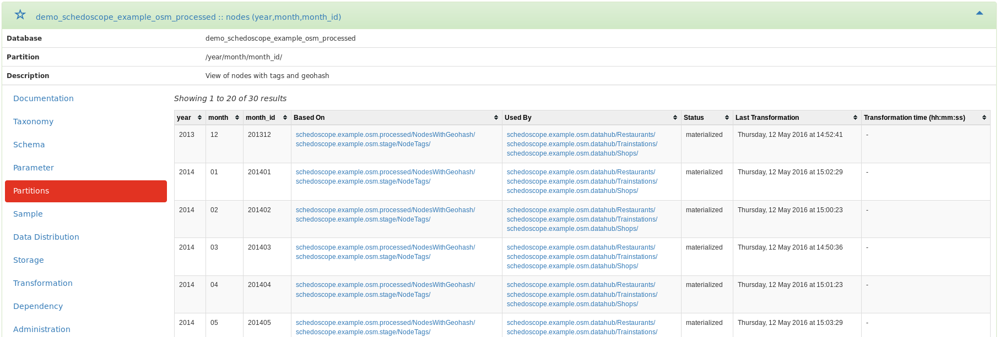
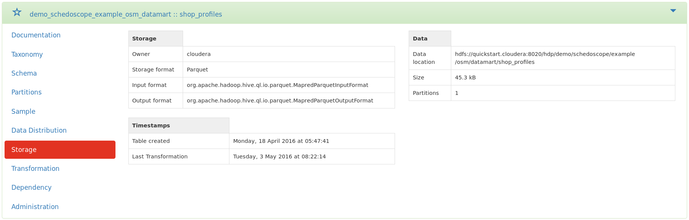

Metascope is a web application for collaborative discovery, search, annotation, and documentation of your Hadoop datahub.

Metascope uses Schedoscope's view specifications integrating definitions of table structure, dependencies, and computation logic to build a metadata repository. A lightweight web interface and a REST API exposes this repository to users - not just technical users but **especially business users** - and applications.

Metascope offers
* a **complete overview of the Hive tables** of your datahub that were created as Schedoscope views
* an index for **faceted navigation** and **full-text search**
* **data lineage** throughout all tables and table partitions
* a detailed overview of **all critical metadata** in one place
* **collaboration features**: create in-line documentation and comments on many different levels
* the ability to create **custom taxonomies** and to **tag and categorize** your data
* partition, data samples, data distribution and many more ...

In the following, we present and describe the main features of Metascope in more detail. 

## Faceted navigation and full-text search
Metascope uses a relational database to catalog information about views from Schedoscope and further metadata from other sources, such as the Hive Metastore. For navigation and search purposes, all data is indexed by [Apache Solr](http://lucene.apache.org/solr/). This allows Metascope to offer users faceted navigation and full-text search.

[[[images/filtersearch.png|alt="Navigation"]]](https://raw.githubusercontent.com/wiki/ottogroup/schedoscope/images/filtersearch.png)

With the combination of full-text search and faceted navigation, users have a simple mechanism at their disposal to discover interesting tables / views while at the same time being able to drill down and hone in quickly on interesting information. 

The facets can be combined arbitrarily and always show the number of results that will be returned when selecting the facet.

There are facets for:
* **type** (show Hive tables or table partitions)
* **database name** 
* **table name**
* **scheduling status**
* **transformation types** with which tables / partitions were computed
* **exports** declared in Schedoscope to external systems (JDBC / Redis / Kafka)
* table / partition **creation time**
* **latest transformation time**
* [**taxonomies and tags**](#taxonomies-and-tags)
* table **partition parameters**

The full-text search also offers an auto-complete function based on already indexed data to help the user to get more and precise search results.

## Inline documentation
Metascope extracts view descriptions that were provided by the developers of views via the Schedoscope view DSL and stores them in its metadata catalog for display and search. These are usually of rather technical nature and terse. 

Metascope gives users - in particular business users - the ability to collaboratively annotate and extend this documentation. A WYSIWYG editor allows one to easily create richly formatted table documentation (fonts, size, colors, HTML structures, ...), which is then stored alongside the developer-provided documentation in Metascope's catalog and indexed for search as well. There is no need to use external systems like [Confluence](https://www.atlassian.com/software/confluence) for business documentation, keeping it more consistent and in-sync with your datahub's reality.

One can assign a data owner (person responsible) to a table as an additional means of documentation. This is meant to be interpreted as a "go-to-person" with detailed knowledge about the table. Should the data owner be identical to a Metascope user account, additional contact information is displayed.

## Taxonomies and tags

Metascope can align your datahub's tables with business concepts. Metascope administrators can create taxonomies of business objects, IT systems, organizations, or other concepts. Users can then label tables using those taxonomies. As taxonomies are indexed and included both in the faceted and full-text search, this increases the search and browsing capabilities of business users.

Metascope taxonomies have a name and consist of a set of (business) objects, which can be grouped into categories. I.e., Metascope taxonomies constitute two-level concept hierarchies. Each category and category object can be given a name and a description.

Users are able to assign category objects to tables via simple drop-down menus, one for each defined taxonomy. 

In case that the administrator-defined taxonomies do not satisfy one's classification needs, Metascope users can also assign arbitrary tags to tables. Tags are also indexed and accessible by faceted navigation and full-text search.

## View schema
The schema section shows the fields of a table. It displays the field name, type, and developer-provided description. Just like for tables, users are able to create additional documentation for each field using the WYSIWYG editor.

If the table is partitioned, a separate section named 'Parameters' shows a similar table with the partition parameters.

## Data Lineage
One of the key features of Metascope is the ability to trace data lineage of tables and table partitions. Understanding the flow of data through your datahub is essential for interpreting data, judging its origins and quality.

Schedoscope views explicitly specify their dependencies. This makes it easy for Metascope to gather dependency information and display it to the users. There is no need for retroactive crawling through Hadoop system logs to infer data lineage information, which would not only be computationally expensive and frequently inaccurate but most likely too technical and fine-grained for consumption by business users.

The dependency section shows all tables from which the current table was computed as well as all tables which are computed from the current table. 

As a default, only direct dependencies are shown. *Show transitive dependencies* will recursively navigate through the lineage graph and display all direct and indirect dependencies. This is a neat feature if one wants to judge the impact a change to a table would have.

The lineage graph provides a visual representation of data lineage information. Navigating this graph, users can get a better understanding of the interrelationships between tables and navigate between them.

## Table partitions
This section displays all partitions on the table. It shows the partition parameters and their values, Schedoscope's scheduling status for the partition, when the last successful transformation of the partition occurred, and how long it took.

Furthermore, data lineage information is given not just for tables but for partitions as well. One can investigate from which partitions a given partition was derived and which other partitions were computed based on this partition. One can also display transitive dependencies.

## Data samples 
The sample sections shows a small (ten rows) data sample of the current table to give the user an impression of what's in a table. If the table is partitioned, the user is able to retrieve a sample for a specific partition.

## Data distribution

While seeing data samples is definitely helpful for a user trying to make sense of a table, another piece of the puzzle is information about the domains of fields. The schema section already describes the fields' data types. The data distribution section additionally takes a look at the concrete values within each field and generates metrics describing field domains more precisely.

The following field domain metrics are computed depending of the field types:
* int/float/double/long: min, max, average, standard derivation, sum
* boolean/String: min, max
* any: enum (If a field contains less than 255 distinct values, Metascope will interpret the field as an enumeration and display the values)

## View storage 

This section shows technical metadata and storage information about a table.

Following metrics are displayed if available:
* **Owner**: the technical user which owns the underlying data files
* **Permissions**: the permissions of underlying data files
* **Storage format**: storage format defined in Schedoscope
* **Input format**: the appropriate input format from the Hive Metastore
* **Output format**: the appropriate output format from the Hive Metastore
* **Location**: the location of the underlying data files
* **Size**: the total size of the underlying data files
* **Partitions**: the total amount of partitions for this view
* **Table created**: timestamp of table creation (in Hive Metastore)
* **Last transformation**: last materialization of the view
* **Last data from**: the latest data row, which illustrates how current a view is (see [View administration](#view-administration))
* **Last partition created**: timestamp of last partition creation (in Hive Metastore)

## View transformation
This section provides information about the way data in a table is computed. For example, the respective HiveQL query is shown for tables computed by Hive transformations.

Schedoscope additionally allows one to [export](https://github.com/ottogroup/schedoscope/wiki/Schedoscope%20View%20DSL%20Primer#view-exports) view data to external systems. Each export and its parameters will be displayed next to the transformation information.

## Collaboration

Metascope comes with various collaborative features. Together, users can
* create documentation for each view, its fields and its parameters;
* create taxonomies and categorize the data with category objects and tags;
* discuss a tables and fields using comments.

Moreover,
* an activity stream shows recent changes and discussions in Metascope;
* a most viewed datasets view shows the most clicked tables;
* one can tag tables as 'favourites' to define navigational short cuts.

## User management
Metascope implements a simple user management. As an administrator, you are able to create, edit and delete users to administrate access and privileges. Furthermore Metascope comes with an LDAP integration: Check [the configuration](https://github.com/ottogroup/schedoscope/wiki/Configuring%20Metascope) on how to use LDAP with Metascope.

## View administration
* **Invalidate and materialize views**: As an administrator, you are able to trigger Schedoscope invalidation and materialization commands from Metascope.
* **Set the timestamp field**: The storage sections contains the metadata 'Last data from', which shows the timestamp of the *latest* record. Metascope tries to guess the timestamp field and its format, but sometimes the information needs to be set manually. This is possible in the 'Administration' section.
(e.g. you have a table named *sales* with a field called *ts* which contains a timestamp with ISO 8601 format, say *YYYY-MM-DDThh:mm:ss*. Set the timestamp field to *ts* and the timestamp format to *YYYY-MM-DD'T'hh:mm:ss*)