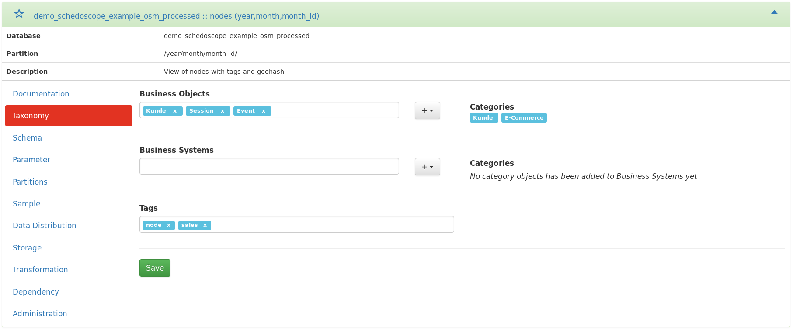

Metascope is a web application which allows you to discover, search, annotate and document your Hadoop datahub.

Metascope uses the internal view descriptions from Schedoscope to build a metadata repository. A lightweight web interface and a REST API exposes all critical metadata to the user.

Metascope offers
* a **complete overview of all views** of your datahub
* an search index which allows **faceted navigation** and **full-text search**
* **data lineage** throughout all views
* an detailed overview of **all critical metadata** in one spot
* **collaboration features**: create in-line documentation and comments on many different levels
* the possibility to create **custom taxonomies** and to **tag and categorize** your data
* data samples, data distribution and many more ...

In the following, we will present and describe each feature of Metascope in detail. 

## Faceted navigation and full-text search
Metascope uses a relational database to store the Schedoscope data and further metadata from various Hadoop frameworks. For navigation and search purposes, all data is indexed by [Apache Solr](http://lucene.apache.org/solr/). This allows Metascope to offer the user a faceted navigation and a full-text search.

The faceted navigation gives the user a simple mechanism to find a specific view in seconds. The full-text search can be used to refine the search results. The facets can be combined arbitrary and always show the number of resulting hits.

There are facets for:
* Type (Table or Partition)
* Database name
* Table name
* Table status
* Table transformations
* Table exports
* Creation time
* Last transformation time
* [Taxonomies and tags](#taxonomies-and-tags)
* Partition parameters

The full-text search also offers a auto-complete function depending on the indexed data to help the user to get more and precise search results.

## Rich inline documentation
Metascope gives you the ability to document your view. A WYSIWYG editor allows to create rich documentation (Fonts, Size, Colors, HTML structures, ...) and stores it right at your view. There is no need to use external portals or wikis like [Confluence](https://www.atlassian.com/software/confluence) anymore, which allows more consistent documentation of your datahub.

Besides documenting on table level, each table field and parameter can be documented similarly.

## Taxonomies and tags
Taxonomies can be created, maintained, and assigned to the datasets. This allows to categorize your views throughout the entire datahub and increase the search and browsing capabilities for the users.

Each taxonomy consists of a taxonomy name and a set of categories, which in turn also has a name and a set of category objects. The category object is an entity which can be assigned to a view. It contains a object name and an appropriate description.

## View schema

## Data Lineage

## Data sample and distribution

## View storage and transformation information

## Collaboration
* Create documentation for each view, its fields and its parameters
* Create taxonomies and categorize the data with category objects and free tags
* Discuss a certain view with your colleagues
* Recent activity stream
* Most viewed datasets

## User management
* LDAP Authentication or custom user management
* Different groups which will show other content to different users (TODO)

## View administration
* Invalidate and materialize your Schedoscope views from Metascope
* Set the data owner ('person responsible')
* Set the timestamp field for 'Last data from' metadata