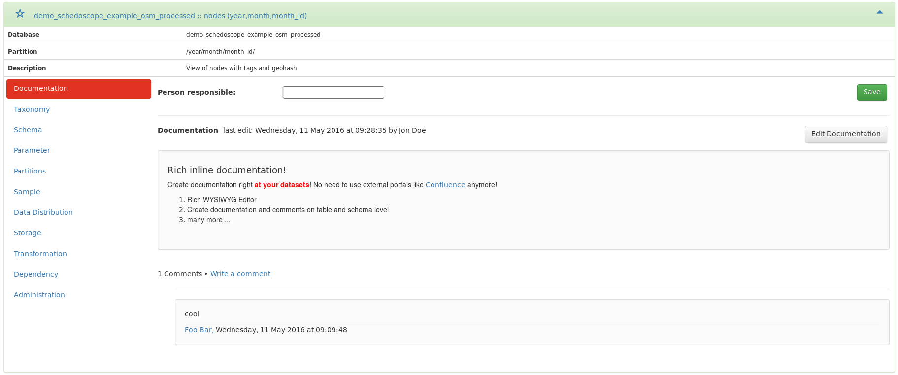

Metascope is a web application which allows you to discover, search, annotate and document your Hadoop datahub.

Metascope uses the internal view descriptions from Schedoscope to build a metadata repository. A lightweight web interface and a REST API exposes all critical metadata to the user.

Metascope offers
* a **complete overview of all views** of your datahub
* an search index which allows **facetted navigation** and **full-text search**
* **data lineage** throughout all views
* an detailed overview of **all critical metadata** in one spot
* **collaboration features**: create inline documentation and comments on many different levels
* the possibility to create **custom taxonomies** and to **tag and categorize** your data
* data samples, data distribution and many more ...

In the following, we will present and describe each feature of Metascope in detail. 

## Facetted navigation and full-text search
Metascope uses a relational database to store the Schedoscope data and further metadata from various Hadoop frameworks. For navigation and search purposes, all data is indexed by [Apache Solr](http://lucene.apache.org/solr/). This allows Metascope to offer the user a facetted navigation and a full-text search.

a

## Rich inline documentation

## Taxonomies and tags

## View schema

## Data Lineage

## Data sample and distribution

## View storage and transformation information

## Collaboration
* Create documentation for each view, its fields and its parameters
* Create taxonomies and categorize the data with category objects and free tags
* Discuss a certain view with your colleagues
* Recent activity stream
* Most viewed datasets

## User management
* LDAP Authentication or custom user management
* Different groups which will show other content to different users (TODO)

## View administration
* Invalidate and materialize your Schedoscope views from Metascope
* Set the data owner ('person responsible')
* Set the timestamp field for 'Last data from' metadata