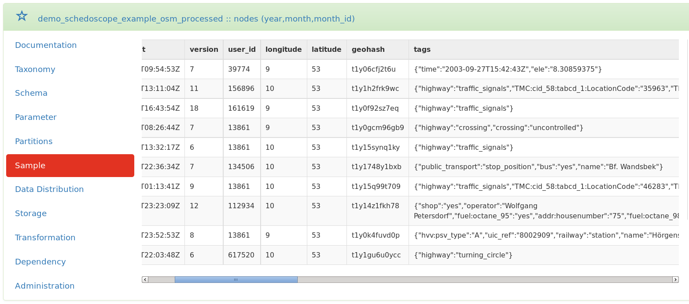
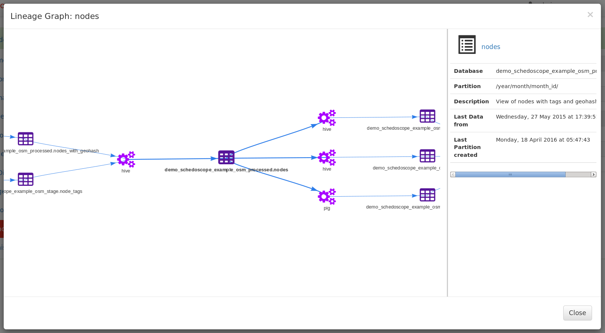

## Goals
The goals of this tutorial are to:

* get the [[Schedoscope tutorial code running|Open Street Map Tutorial#installing]] in the Cloudera Quickstart VM; 
* [[watch Schedoscope doing its work|Open Street Map Tutorial#watching-schedoscope-work]];
* [[explore the results|Open Street Map Tutorial#exploring-the-results]];
* [[explore Metascope|Open Street Map Tutorial#exploring-the-results-and-data-lineage-with-Metascope]];
* [[watch Schedoscope dealing with change|Open Street Map Tutorial#dealing-with-change]];
* understand [[the components of a view specification|Open Street Map Tutorial#how-does-this-work]];
* get familiar with the [[Schedoscope test framework|Open Street Map Tutorial#exploring-the-test-framework]];
* get the [[tutorial running on your own Hadoop Cluster|Open Street Map Tutorial#running-on-a-real-cluster]];
* show [[how to integrate Schedoscope with cron|Open Street Map Tutorial#scheduling]].

## Prerequisites
* Basic knowledge of [Apache Hive](http://Hive.apache.org/)

## The Story
Imagine you had a fantastic business idea. You would like to buy a promising shop in Hamburg, Germany. However... **which shop in Hamburg is the one located best?**

For implementing this tutorial, we use geospatial data from the [Open Street Map](http://www.openstreetmap.org/copyright) project. The data is available in two TSV files, which for convenience we provide by the Maven artifact `schedoscope-tutorial-osm-data`. The structure of the files looks like this:

        nodes  -- points on the map defined by longitude and latitude 

          id BIGINT
          version INT
          user_id INT
          tstamp TIMESTAMP
          changeset_id BIGINT
          longitude DOUBLE
          latitude DOUBLE

        node_tags  -- tags describing a node's feature
          node_id BIGINT
          k STRING
          v STRING

For measuring the "best" shop location, we assume the following:
* The more _restaurants_ are around, the more customers will show up. (+)
* The more _trainstations_ are around, the more customers will show up. (+)
* The more other _shops_ are around, the fewer customers will show up. They rather might go to the competitors. (-)

To measure distance, we use a geo hash. Two nodes are close to each other if they lie in the same area. A node's area is defined by the first 7 characters of `GeoHash.geoHashStringWithCharacterPrecision(longitude, latitude)`.

### The Plan

1. Calculate each node's geohash

2. Filter for restaurants, trainstations, and shops 

3. Provide aggregated data such that the measures can be applied; the aggregation is stored in view `schedoscope.example.osm.datamart/ShopProfiles`. You can then find the best location for your shop by analyzing `schedoscope.example.osm.datamart/ShopProfiles`.

For the tutorial, we translated this plan into a hierarchy of interdependent Schedoscope views, which means Hive tables:
 

## Installing
Let's get started:

1. Download [Cloudera Quickstart VM 5.4](http://www.cloudera.com/content/www/en-us/downloads/quickstart_vms/5-4.html). The tutorial has been tested with the VirtualBox variant of it.

2. Start Cloudera VM.

3. Open a terminal, create the base directory and set the appropriate permissions in HDFS:

        [cloudera@quickstart ~]$ sudo su - hdfs
        -bash-4.1$ hdfs dfs -mkdir /hdp /user/cloudera
        -bash-4.1$ hdfs dfs -chown -R cloudera:cloudera /hdp /user/cloudera
        -bash-4.1$ exit

4. Clone the Schedoscope git repository:

         [cloudera@quickstart ~]$ cd ~
         [cloudera@quickstart ~]$ git clone https://github.com/ottogroup/schedoscope.git

5. Go into directory `schedoscope` and build the project:

         [cloudera@quickstart ~]$ cd ~/schedoscope
         [cloudera@quickstart schedoscope]$ mvn install -DXX:MaxPermSize=512m

## Watching Schedoscope work

1. Launch Schedoscope:

        [cloudera@quickstart schedoscope]$ cd ~/schedoscope/schedoscope-tutorial
        [cloudera@quickstart schedoscope-tutorial]$ mvn exec:java

2. The Schedoscope Shell opens in the terminal. You can find the full [[command reference|Scheduling Command Reference]] in the Schedoscope wiki.

3. Type  `materialize -v schedoscope.example.osm.datamart/ShopProfiles`

    to trigger all data ingestions and view computations leading to the requested view of shop profiles.

5. Type  `views`
    and see which views are already materialized with current data.

        schedoscope> views
        Starting VIEWS ...

        RESULTS
        =======
        Details:
        +-----------------------------------------------------+--------------+-------+
        |                         VIEW                        |    STATUS    | PROPS |
        +-----------------------------------------------------+--------------+-------+
        | schedoscope.example.osm.processed/NodesWithGeohash/ | materialized |       |
        |     schedoscope.example.osm.processed/Nodes/2014/04 | transforming |       |
        |     schedoscope.example.osm.processed/Nodes/2014/10 | transforming |       |
        |     schedoscope.example.osm.processed/Nodes/2014/07 | transforming |       |
        |     schedoscope.example.osm.processed/Nodes/2014/01 | transforming |       |
        |     schedoscope.example.osm.processed/Nodes/2015/05 | transforming |       |
        |        schedoscope.example.osm.datahub/Restaurants/ |      waiting |       |
        |     schedoscope.example.osm.processed/Nodes/2015/02 | transforming |       |
        |     schedoscope.example.osm.processed/Nodes/2014/12 | transforming |       |
        |              schedoscope.example.osm.datahub/Shops/ |      waiting |       |
        |     schedoscope.example.osm.processed/Nodes/2014/09 | transforming |       |
        |                schedoscope.example.osm.stage/Nodes/ | materialized |       |
        |     schedoscope.example.osm.processed/Nodes/2014/03 | transforming |       |
        |     schedoscope.example.osm.processed/Nodes/2014/06 | transforming |       |
        |      schedoscope.example.osm.datamart/ShopProfiles/ |      waiting |       |
        |             schedoscope.example.osm.stage/NodeTags/ | materialized |       |
        |     schedoscope.example.osm.processed/Nodes/2015/04 | transforming |       |
        |     schedoscope.example.osm.processed/Nodes/2014/05 | transforming |       |
        |     schedoscope.example.osm.processed/Nodes/2014/11 | transforming |       |
        |     schedoscope.example.osm.processed/Nodes/2015/01 | transforming |       |
        |     schedoscope.example.osm.processed/Nodes/2014/08 | transforming |       |
        |     schedoscope.example.osm.processed/Nodes/2014/02 | transforming |       |
        |      schedoscope.example.osm.datahub/Trainstations/ |      waiting |       |
        |     schedoscope.example.osm.processed/Nodes/2015/03 | transforming |       |
        |     schedoscope.example.osm.processed/Nodes/2015/06 | transforming |       |
        |     schedoscope.example.osm.processed/Nodes/2013/12 | transforming |       |
        +-----------------------------------------------------+--------------+-------+
        Total: 26

        materialized: 3
        transforming: 19
        waiting: 4

6. Type `transformations -s running` to see what is going on.

6. Take a look at the resource manager of the virtual Hadoop Cluster in Firefox (http://localhost:8088/cluster)
    and see whether you can identify the running actions on the cluster.

6. Opening another terminal window, you can also take a look at the activity in the log file:

        [cloudera@quickstart ~]$ tail -F ~/schedoscope/schedoscope-tutorial/target/logs/schedoscope.log

9. Type `shutdown` or `^C` in the Schedoscope shell if you want to stop Schedoscope. You should wait for it to complete the materialization of views to continue with the tutorial, though.

## Exploring the results

Open a new terminal. Use the Hive CLI to see the data materialized by Schedoscope:

1. Start Hive: 

        [cloudera@quickstart ~]$ hive

2. List the databases that Schedoscope automatically created: 

        hive> show databases;

   The database names look like `{environment}_{packagename}`, with the dots in the package name of the materialized views replaced by underscores. The environment is set in `~/schedscope/schedoscope-tutorial/src/main/resources/schedoscope.conf`.

3. List the tables of a database: 

        hive> use demo_schedoscope_example_osm_datamart;
        hive> show tables;

   A table name is the name of the corresponding view class extending base class `View` in lower case. E.g. `NodesWithGeohash` becomes a Hive table named `nodes_with_geohash`.

4. List the columns of a table: 

        hive> describe shop_profiles;

   Column names are the same as the names of the fields specified in the corresponding view class, similarly transformed to lower case.

5. List the first 10 entries of a table: 

        hive> select * from shop_profiles limit 10;

6. Take a look around the tables yourself.

   As one can see, every tutorial table does contain columns `id`, `created_at` (when was the data loaded)
and `created_by` (which Job provided the data). These fields are defined using common  [[traits|View Traits]] carrying predefined fields.

7. Let's take a surprised look at the MySQL server running in the quickstart VM: 
        
        [cloudera@quickstart ~]$ mysql schedoscope_tutorial -u root -pcloudera

        mysql> select * from demo_schedoscope_example_osm_datamart_shop_profiles limit 10;

   A MySQL export has been configured with the `ShopProfiles` view. As a result, not only has `ShopProfiles` been materialized in Hive; after transformation, Schedoscope created an equivalent table in MySQL and exported `ShopProfiles` to that table using a mapreduce job. Schedoscope's export module supports simple, parallel export to [JDBC](JDBC Export), [Redis](Redis Export), and [Kafka](Kafka Export).

## Exploring the results and data lineage with Metascope

Metascope is a metadata management platform for Schedoscope. It lets you browse and search your views, their schema information, data lineage and many more through a REST API or web interface. 

Let's start Metascope:

1. Open a new terminal (Note: Schedoscope still needs to be running).

2. Change the directory and start Metascope:

        [cloudera@quickstart ~]$ cd schedoscope/schedoscope-metascope
        [cloudera@quickstart ~]$ MAVEN_OPTS='-Xmx1024m -XX:MaxPermSize=512M' mvn exec:java -Dconfig.file=../schedoscope-tutorial/src/main/resources/schedoscope.conf

3. Browse to http://localhost:8080 and login with user `admin` and password `admin`

Metacope offers you many possibilities to navigate and browse through the metadata of your datahub. Use the facetted filters and search functionality to find the view you need.

Click on a view to open the table detail page. This page shows all critical metadata of the selected table. Use the navigation tabs to browse through the different sections, e.g. click on 'Sample' tab to view a sample of the data:

You need to know the dependencies for a table or need to figure out which other tables are using a specific view? Metascope will tell you in seconds:  

Take a look at the lineage graph to get a better understanding of your data. Click on the nodes to get further metadata for tables and transformations, e.g. last transformations timestamps and table status information:

Visit [Metascope](#) to get a complete list of features which Metascope has to offer.

## Dealing with change

One way to deal with change is to explicitly retrigger computation of views:

7. Type  `invalidate -v schedoscope.example.osm.datahub/Restaurants` in the schedoscope shell.
    This is how to manually tell Schedoscope that this view shall be recalculated.

        schedoscope> views
        Starting VIEWS ...

        RESULTS
        =======
        Details:
        +-----------------------------------------------------+--------------+-------+
        |                         VIEW                        |    STATUS    | PROPS |
        +-----------------------------------------------------+--------------+-------+
        | schedoscope.example.osm.processed/NodesWithGeohash/ | materialized |       |
        |     schedoscope.example.osm.processed/Nodes/2015/05 | materialized |       |
        |        schedoscope.example.osm.datahub/Restaurants/ |  invalidated |       |
        |      schedoscope.example.osm.datamart/ShopProfiles/ | materialized |       |
...

        |     schedoscope.example.osm.processed/Nodes/2015/06 | materialized |       |
        |     schedoscope.example.osm.processed/Nodes/2013/12 | materialized |       |
        +-----------------------------------------------------+--------------+-------+
        Total: 26

        materialized: 25
        invalidated: 1

8. Type  `materialize -v schedoscope.example.osm.datamart/ShopProfiles`

    Type  `views` to see that only `demo_schedoscope_example_osm_datahub.restaurants` and its depending view `demo_schedoscope_example_osm_datamart.ShopProfiles` are recalculated. Schedoscope knows that the other views' data still is up-to-date.

        | schedoscope.example.osm.processed/NodesWithGeohash/ | materialized |       |
        |     schedoscope.example.osm.processed/Nodes/2014/04 | materialized |       |
        |     schedoscope.example.osm.processed/Nodes/2015/05 | materialized |       |
        |        schedoscope.example.osm.datahub/Restaurants/ | transforming |       |
        |              schedoscope.example.osm.datahub/Shops/ | materialized |       |
        |                schedoscope.example.osm.stage/Nodes/ | materialized |       |
        |      schedoscope.example.osm.datamart/ShopProfiles/ |      waiting |       |
        |             schedoscope.example.osm.stage/NodeTags/ | materialized |       |
        |      schedoscope.example.osm.datahub/Trainstations/ | materialized |       |
        +-----------------------------------------------------+--------------+-------+
        Total: 26

        materialized: 24
        transforming: 1
        waiting: 1

8. Switch to Hive CLI and compare column `created_at` of `restaurants` and `shops`. As you can see table `restaurants` has been written again during recalculation. Table `shops` has not been touched.

9. Have a look at the logfile `schedoscope/schedoscope-tutorial/target/logs/schedoscope.log`.

9. Once everything has been materialized, type `shutdown` to stop Schedoscope.

_Way more interesting is to see Schedoscope discover change all by itself, however!_

7. Make sure all views have been materialized and that you have quit the Schedoscope shell.

7. Go back to the `schedoscope-tutorial` folder: `cd ~/schedoscope/schedoscope-tutorial`

7. Open the query that computes the `Restaurants` view in an editor:

        [cloudera@quickstart schedoscope-tutorial]$ vim src/main/resources/Hiveql/datahub/insert_restaurants.sql 

7. From now on, restaurant names are to be uppercase. So wrap the statement

        tags['name'] AS restaurant_name,

   into
   
        ucase(tags['name']) AS restaurant_name,

7. Save your work and go back to the shell.

7. Recompile the tutorial (skipping tests, as the restaurant test will fail now):

        [cloudera@quickstart schedoscope-tutorial]$ mvn install -DskipTests

7. Relaunch Schedoscope:

        [cloudera@quickstart schedoscope-tutorial]$ mvn exec:java

7. Materialize `schedoscope.example.osm.datamart/ShopProfiles/` again:

        schedoscope> materialize -v schedoscope.example.osm.datamart/ShopProfiles

8. Watch Schedoscope rematerialize `schedoscope.example.osm.datahub/Restaurants` and `schedoscope.example.osm.datamart/ShopProfiles` without any explicit migration commands from your side. No other views are recomputed because they are not affected by the change. 

   The criteria for detecting changes to transformation logic depend on the respective transformation type. Please have a look at the various transformation type descriptions for more information on this topic.

9. Take again a look at the MySQL database:

        [cloudera@quickstart ~]$ mysql schedoscope_tutorial -u root -pcloudera
        
        mysql> select * from demo_schedoscope_example_osm_datamart_shop_profiles limit 10;

   Note how the changes have been reflected by the MySQL export as well.

## How does this work?

In order to understand how the demonstrated functionality is possible, it is time to look at the constituents of a view specification. This is best done from within a Scala IDE.

### Set up the IDE

1. Download [Scala IDE for Eclipse](http://scala-ide.org/download/sdk.html) into your quickstart VM (Note that you can also use IntelliJ).

        [cloudera@quickstart ~]$ wget http://downloads.typesafe.com/scalaide-pack/4.4.0-vfinal-luna-211-20160401/scala-SDK-4.4.0-vfinal-2.11-linux.gtk.x86_64.tar.gz

2. Extract it to a folder and launch it:

        [cloudera@quickstart ~]$ tar xzf scala-SDK-4.4.0-vfinal-2.11-linux.gtk.x86_64.tar.gz 
        [cloudera@quickstart ~]$ cd eclipse; ./eclipse

3. Select `File > Import > Maven > Existing Maven Projects`

4. Choose the root folder `~/schedoscope`

5. Check all pom.xml files offered to you (schedoscope-suite, -export, -core, -tutorial)

6. Choose import

### Examine `ShopProfiles`

Finally, we are able to take a look at the `ShopProfiles` view. Press `CTRL-T` and start to type `ShopProfile` and you should be able to select `ShopProfiles.scala` in the dialog that pops up. The file looks like this:

    case class ShopProfiles() extends View
        with Id
        with JobMetadata {

      val shopName = fieldOf[String]("The name of the profiled shop")
      val shopType = fieldOf[String]("The type of shop, as given by OSM")
      val area = fieldOf[String]("A geoencoded area string")
      val cntCompetitors = fieldOf[Int]("The number of competitors in the area (shops of the same type)")
      val cntRestaurants = fieldOf[Int]("The number of restaurants in the area")
      val cntTrainstations = fieldOf[Int]("The number of trainstations in the area")

      dependsOn { () => Shops() }
      dependsOn { () => Restaurants() }
      dependsOn { () => Trainstations() }

      transformVia { () =>
        HiveTransformation(
          insertInto(
            this,
            queryFromResource("Hiveql/datamart/insert_shop_profiles.sql"),
            settings = Map("parquet.compression" -> "GZIP")))
          .configureWith(defaultHiveQlParameters(this))
      }

      comment("Shop profiles showing number of nearby competitors, restaurants and trainstations for each shop")

      storedAs(Parquet())

      exportTo(() => Jdbc(this, "jdbc:mysql://localhost:3306/schedoscope_tutorial?createDatabaseIfNotExist=true", "root", "cloudera"))
    }
                
As you can see:

* The specification lists all the fields either directly (via `fieldOf`) or indirectly (via the traits `Id` and `JobMetadata`) that ended up in the `shop_profiles` table. The names of the fields have merely been changed from camel-case to lower case with underscores. 

* Likewise, the table name as well as database name have been derived from the package and the case class names.

* The specification also defines the storage format.

As a consequence, Schedoscope had all the data structure information at hand to create the Hive table. 

Next,

* the specification defines the dependencies of `ShopProfiles` (via `dependsOn`). It depends on the views `Shops`, `Restaurants`, and `Trainstations`.

Given this knowledge of data dependencies, Schedoscope was able to infer a correct materialization and transformation order of views.

Finally,

* the specification defines the transformation logic (using `transformVia`). It is a Hive query kept in the file `insert_shop_profiles.sql`.

* Also, it defines the export to MySQL.

Hence, Schedoscope was able to compute `ShopProfiles` from  `Shops`, `Restaurants`, and `Trainstations`.

What's essential: only because this explicit definition of data structure, dependencies, and logic, Schedoscope is able to identify when changes to structure and logic happen, and to derive a minimal transformation / materialization plan to accommodate the changes.

Refer to the [Schedoscope View DSL Primer](Schedoscope View DSL Primer) for more detailed information about the capabilities of the Schedoscope view DSL.

## Exploring the Test Framework

Schedoscope comes with a nice [Test Framework](Test Framework) that facilitates quick testing of code. 

1. You can run a test by right clicking on a test class in the Scala IDE's package explorer (e.g., `schedoscope-tutorial/src/test/scala/schedoscope/example/osm/datahub/RestaurantsTest.scala`  and choosing `Run As > Scala Test - File`

2. Initially, this will fail because you need to provide a `HADOOP_HOME` environment variable setting. Lookup the IDE's run configuration for your failed test and set `HADOOP_HOME` to `~/schedoscope/schedoscope-tutorial/target/hadoop`. The Schedoscope test framework will automatically deploy a local Hadoop installation in that folder.

3. Rerun the test.

4. Look at the test:

        case class RestaurantsTest() extends FlatSpec
            with Matchers {

          val nodes = new Nodes(p("2014"), p("09")) with rows {
            set(v(id, "267622930"),
              v(geohash, "t1y06x1xfcq0"),
              v(tags, Map("name" -> "Cuore Mio",
                "cuisine" -> "italian",
                "amenity" -> "restaurant")))
            set(v(id, "288858596"),
              v(geohash, "t1y1716cfcq0"),
              v(tags, Map("name" -> "Jam Jam",
                "cuisine" -> "japanese",
                "amenity" -> "restaurant")))
            set(v(id, "302281521"),
              v(geohash, "t1y17m91fcq0"),
              v(tags, Map("name" -> "Walddörfer Croque Café",
                "cuisine" -> "burger",
                "amenity" -> "restaurant")))
            set(v(id, "30228"),
              v(geohash, "t1y77d8jfcq0"),
              v(tags, Map("name" -> "Giovanni",
                "cuisine" -> "italian")))
          }

          "datahub.Restaurants" should "load correctly from processed.nodes" in {
            new Restaurants() with test {
              basedOn(nodes)
              then()
              numRows shouldBe 3
              row(v(id) shouldBe "267622930",
                v(restaurantName) shouldBe "Cuore Mio",
                v(restaurantType) shouldBe "italian",
                v(area) shouldBe "t1y06x1")
            }
          }
        }

As you can see, because Schedoscope views have knowledge about data structure and logic, the test framework is able to exploit that for concise specification of test fixtures, automatic setup of the test environment, and compact specification of assertions.

## Running on a real cluster

You can get the tutorial running on your own hadoop cluster.
 
Install the Schedoscope tutorial on a gateway machine to your cluster:

1. Clone the source code (see [[Installation|Open Street Map Tutorial#installing]] Step 4).

2. Prepare a `/hdp` folder in your cluster's HDFS and give proper write permissions for the user with which you want to execute Schedoscope. (similar to [[Installation|Open Street Map Tutorial#installing]] Step 3).

3. Then change the [[configuration settings|Configuring Schedoscope]] in `schedoscope-tutorial/src/main/resources/schedoscope.conf` to match the needs of your cluster. The [[default configuration settings|Configuring Schedoscope]] are defined in`schedoscope-core/src/main/resources/reference.conf`. They are overwritten by the settings you define in `schedoscope.conf`. Perform the following changes:

        schedoscope {
          app {
             # The chosen environment name is set as root HDFS folder.
             # The data for each view will end up in `/hdp/${env}/${package_name}/${ViewName}`.
             environment = "yourenvironmentasyoulikeit"    
          }

          hadoop {
             resourceManager = "yourhost:yourport"
             nameNode = "hdfs://yourhost:yourport"
          }

          metastore {
            metastoreUri = "thrift://your/Hive/metastore/uri"
            jdbcUrl = "your/Hive/jdbc/uri" # include the kerberos principal if needed
          }

          kerberos {
            principal = "your/kerberos/principal"   # if needed
          }
          
          transformations = {
            Hive : {
                libDirectory = "/your/local/absolute/path/to/schedoscope/schedoscope-tutorial/target/Hive-libraries"
                url = ${schedoscope.metastore.jdbcUrl} #include the kerberos principal if needed
            }
          }
        }

4. Compile Schedoscope (similar to [[Installation|Open Street Map Tutorial#installing]] Step 5).

Go into directory `schedoscope/schedoscope-tutorial` and [[execute|Open Street Map Tutorial#execution]] the tutorial using your own hadoop cluster:

    mvn exec:java

## Scheduling 

Schedoscope offers an [[HTTP API|Schedoscope HTTP API]]. The API is particularly useful for automating job runs and connecting Schedoscope to shell scripts or other ETL tools. 

For example, if you want your data up-to-date 5 minutes past every hour during business time (8am-8pm) simply register a cronjob, such as:

       5   8-20 * * *  curl http://localhost:20698/materialize/schedoscope.example.osm.datamart/ShopProfiles

The registered GET request is the HTTP API equivalent to the `materialize -v schedoscope.example.osm.datamart/ShopProfiles` command you have issued on the shell before. Upon receiving this request, Schedoscope will check for new or changed direct or indirect dependencies to `ShopProfiles`, for structural changes, and changes of transformation logic. Only if any of these criteria apply, Schedoscope will trigger a (re-)computation. 

## Acknowledgement
Our example data was taken from the [Open Street Map project](http://www.openstreetmap.org/copyright)